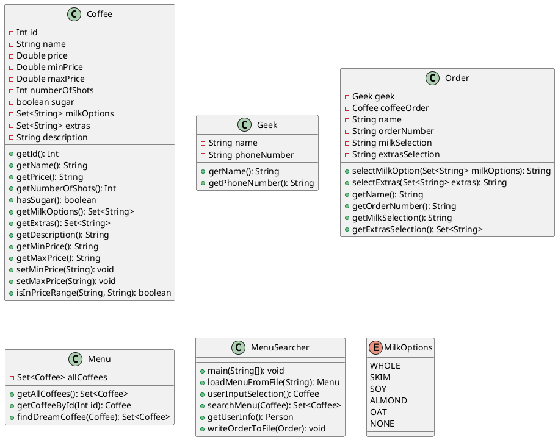

# Design Diagram

```plantuml
@startuml
class Coffee {
    - Int id
    - String name
    - Double price
    - Double minPrice
    - Double maxPrice
    - Int numberOfShots
    - boolean sugar
    - Set<String> milkOptions
    - Set<String> extras
    - String description
    + getId(): Int
    + getName(): String
    + getPrice(): String
    + getNumberOfShots(): Int
    + hasSugar(): boolean
    + getMilkOptions(): Set<String>
    + getExtras(): Set<String>
    + getDescription(): String
    + getMinPrice(): String
    + getMaxPrice(): String
    + setMinPrice(String): void
    + setMaxPrice(String): void
    + isInPriceRange(String, String): boolean
}

class Geek {
    - String name
    - String phoneNumber
    + getName(): String
    + getPhoneNumber(): String
}

class Order {
    - Geek geek
    - Coffee coffeeOrder
    - String name
    - String orderNumber
    - String milkSelection
    - String extrasSelection
    + selectMilkOption(Set<String> milkOptions): String
    + selectExtras(Set<String> extras): String
    + getName(): String
    + getOrderNumber(): String
    + getMilkSelection(): String
    + getExtrasSelection(): Set<String>    
}

class Menu {
    - Set<Coffee> allCoffees
    + getAllCoffees(): Set<Coffee>
    + getCoffeeById(Int id): Coffee
    + findDreamCoffee(Coffee): Set<Coffee>
}

class MenuSearcher {
    + main(String[]): void
    + loadMenuFromFile(String): Menu
    + userInputSelection(): Coffee
    + searchMenu(Coffee): Set<Coffee>
    + getUserInfo(): Person
    + writeOrderToFile(Order): void
}

enum MilkOptions {
    WHOLE
    SKIM
    SOY
    ALMOND
    OAT
    NONE
}

```