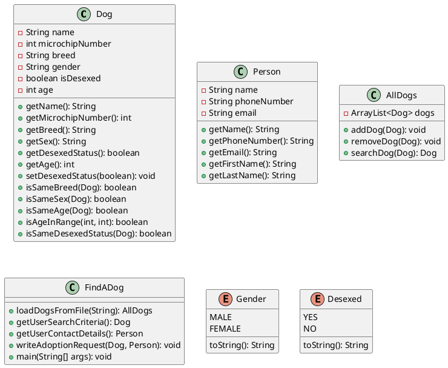

# Dog Adoption UML

```plantuml
@startuml
class Dog {
    - String name
    - int microchipNumber
    - String breed
    - String gender
    - boolean isDesexed
    - int age
    + getName(): String
    + getMicrochipNumber(): int
    + getBreed(): String
    + getSex(): String
    + getDesexedStatus(): boolean
    + getAge(): int
    + setDesexedStatus(boolean): void
    + isSameBreed(Dog): boolean
    + isSameSex(Dog): boolean
    + isSameAge(Dog): boolean
    + isAgeInRange(int, int): boolean
    + isSameDesexedStatus(Dog): boolean
}

class Person {
    - String name
    - String phoneNumber
    - String email
    + getName(): String
    + getPhoneNumber(): String
    + getEmail(): String
    + getFirstName(): String
    + getLastName(): String
}

class AllDogs {
    - ArrayList<Dog> dogs
    + addDog(Dog): void
    + removeDog(Dog): void
    + searchDog(Dog): Dog
}

class FindADog {
    + loadDogsFromFile(String): AllDogs
    + getUserSearchCriteria(): Dog
    + getUserContactDetails(): Person
    + writeAdoptionRequest(Dog, Person): void
    + main(String[] args): void
}

enum Gender {
    MALE
    FEMALE
    toString(): String  
}

enum Desexed {
    YES
    NO
    toString(): String
}
@enduml
```